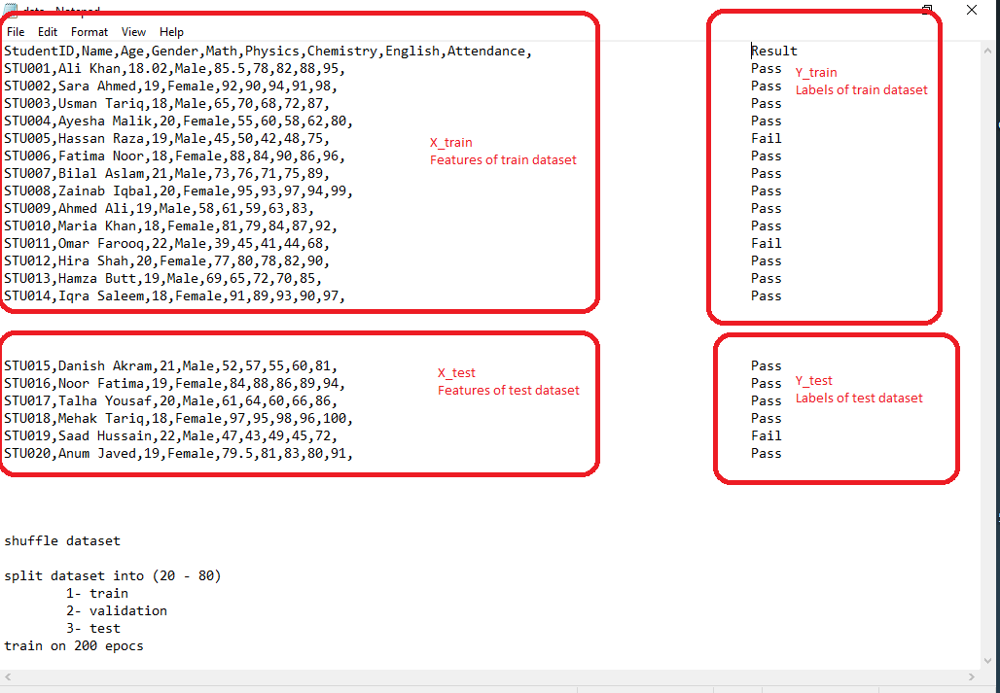

# #######################################################

# 📢📢  Attention Please 📢📢
## New Assignment has beed added in "Tasks" folder
## See in "Tasks/Assignment_9" file
# #######################################################
____________________________________________________________________________________________________________

# Machine_Learning_Course_Digiboost

[Lecture 1 : Introduction ](https://malikabdulsalam.github.io/Machine_Learning_Course_Digiboost/1-Day2_AI_Introduction.html)

[Lecture 2 : Data Preprocessing ](
https://malikabdulsalam.github.io/Machine_Learning_Course_Digiboost/2-Data_preprocessing.html)

[Lecture 3 : Data Preprocessing Practical ](https://malikabdulsalam.github.io/Machine_Learning_Course_Digiboost/2-Data_preprocessing_practical.html)

[Lecture 4 : Data Visiuallization ](https://malikabdulsalam.github.io/Machine_Learning_Course_Digiboost/8-data_visiuallization.html)

[Lecture 5 : Linear Regression ](https://malikabdulsalam.github.io/Machine_Learning_Course_Digiboost/26-Linear_regression.html)

[Lecture 6 : Polynomial Regression  single feature](https://malikabdulsalam.github.io/Machine_Learning_Course_Digiboost/27-Polynomial_regression_one_feature.html)

[Lecture 7 : Polynomial Regression  Multiple features ](https://malikabdulsalam.github.io/Machine_Learning_Course_Digiboost/27-Polynomial_regression_multiple_featues.html)

