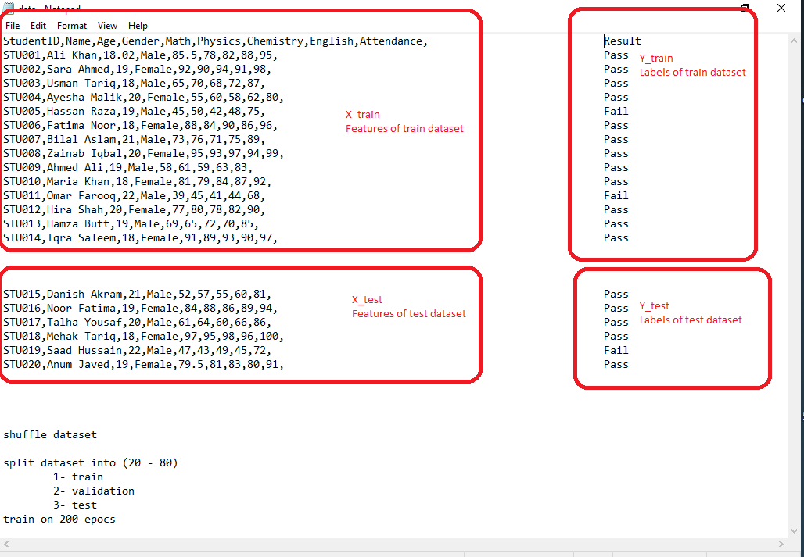
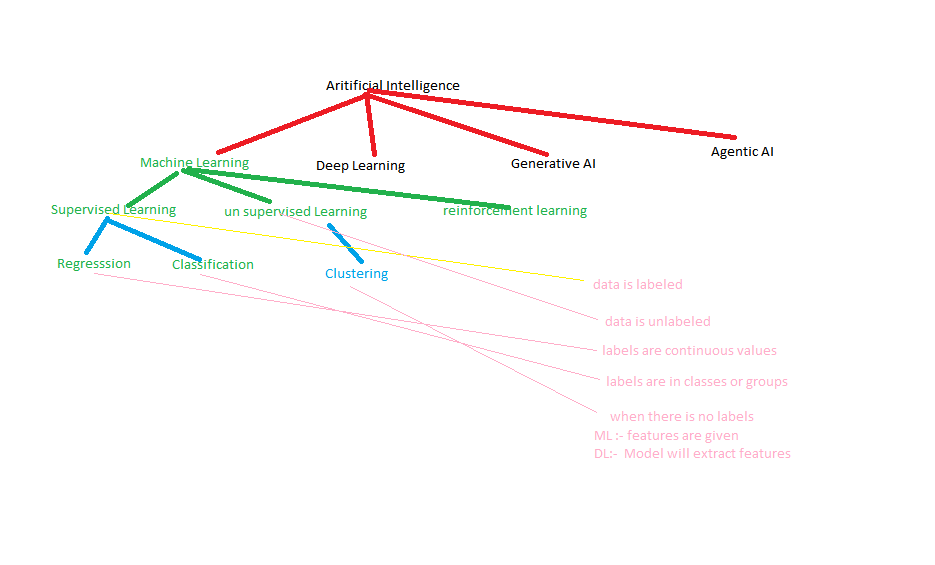
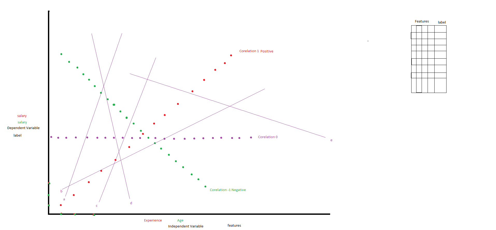
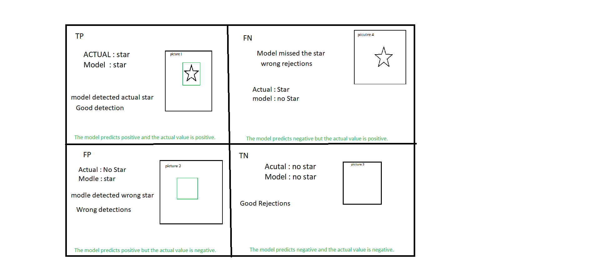

# #######################################################

# 📢📢  Attention Please 📢📢
## New Assignment has beed added in "Tasks" folder
## See in "Tasks/Assignment_18_mean_std_bell_curve" file
# #######################################################
____________________________________________________________________________________________________________

# Machine_Learning_Course_Digiboost

[Lecture 1 : Introduction ](https://malikabdulsalam.github.io/Machine_Learning_Course_Digiboost/1-Day2_AI_Introduction.html)

[Lecture 2 : Data Preprocessing ](
https://malikabdulsalam.github.io/Machine_Learning_Course_Digiboost/2-Data_preprocessing.html)

[Lecture 3 : Data Preprocessing Practical ](https://malikabdulsalam.github.io/Machine_Learning_Course_Digiboost/2-Data_preprocessing_practical.html)

[Lecture 4 : Data Visiuallization ](https://malikabdulsalam.github.io/Machine_Learning_Course_Digiboost/8-data_visiuallization.html)

[Lecture 5 : Linear Regression ](https://malikabdulsalam.github.io/Machine_Learning_Course_Digiboost/26-Linear_regression.html)

[Lecture 6 : Polynomial Regression  single feature](https://malikabdulsalam.github.io/Machine_Learning_Course_Digiboost/27-Polynomial_regression_one_feature.html)

[Lecture 7 : Polynomial Regression  Multiple features ](https://malikabdulsalam.github.io/Machine_Learning_Course_Digiboost/27-Polynomial_regression_multiple_featues.html)

[Lecture 8 : Regression Summary ](https://malikabdulsalam.github.io/Machine_Learning_Course_Digiboost/33-Regression_summary.html)

[Lecture 9 : Evaluation Matrics Comparison ](https://malikabdulsalam.github.io/Machine_Learning_Course_Digiboost/34-Metrices_comparison.html)

[Lecture 10 : ML Types Comparison ](https://malikabdulsalam.github.io/Machine_Learning_Course_Digiboost/35-ML_types_comparison.html)

[Lecture 11 : KNN Classification ](https://malikabdulsalam.github.io/Machine_Learning_Course_Digiboost/36-KNN_Classification.html)

[Lecture 12 (a) : Fronted KNN example ](https://malikabdulsalam.github.io/Machine_Learning_Course_Digiboost/38-frontend_KNN.html)

[Lecture 12 (b): Classification Models python ](https://malikabdulsalam.github.io/Machine_Learning_Course_Digiboost/44-classification_model.html)

[Lecture 12 (b): Classification Models Python ](https://malikabdulsalam.github.io/Machine_Learning_Course_Digiboost/45-Classification_models.html)

[Lecture 13 : Flak API ](https://malikabdulsalam.github.io/Machine_Learning_Course_Digiboost/39-ML_Flask.html)

[Lecture 14 : Example of Flak API ](https://malikabdulsalam.github.io/Machine_Learning_Course_Digiboost/40-ML_Flask_project.html)

[Lecture 15 : Preprocessing_cases ](https://malikabdulsalam.github.io/Machine_Learning_Course_Digiboost/48-Preprocessing_cases.html)

[Lecture 16 : Outliers ](https://malikabdulsalam.github.io/Machine_Learning_Course_Digiboost/49-outliers.html)

[Lecture 17 : Outliers python implementation ](https://malikabdulsalam.github.io/Machine_Learning_Course_Digiboost/50-outliers_python_implementation.html)

[Lecture 18 : Mean and Standerd Deviation ](https://malikabdulsalam.github.io/Machine_Learning_Course_Digiboost/51_mean_standard_Deviation.html)

[Lecture 19 : Github Push Code to repository](https://malikabdulsalam.github.io/Machine_Learning_Course_Digiboost/53_github.html)

[Lecture 20 : Mean adn Standard Deviation ](https://malikabdulsalam.github.io/Machine_Learning_Course_Digiboost/53-mean_std_deviation_tabular.html)

[Lecture 21 : R square and Adjusted R square](https://malikabdulsalam.github.io/Machine_Learning_Course_Digiboost/55_R_square_adjuste_R2.html)

[Lecture 22 : R square and Adjusted R square more](https://malikabdulsalam.github.io/Machine_Learning_Course_Digiboost/56_R_square_adjuste_R2.html)

[Lecture 23 : When to use which model](https://malikabdulsalam.github.io/Machine_Learning_Course_Digiboost/57-when_to_use_which_model.html)

[Lecture 24 : Correlation](https://malikabdulsalam.github.io/Machine_Learning_Course_Digiboost/61-data_checking.html)

[Lecture 24 : Residual](https://malikabdulsalam.github.io/Machine_Learning_Course_Digiboost/61-residuals.html)

[Lecture 25 : Ensemble Learning](https://malikabdulsalam.github.io/Machine_Learning_Course_Digiboost/59-ensemble_learning_bagging_boosting.html)

[Lecture 26 : Confusion Matrices](https://malikabdulsalam.github.io/Machine_Learning_Course_Digiboost/46-confustion_metrics.html)

[Lecture 27 : Confusion Matrices Precision Recall F1-Score](https://malikabdulsalam.github.io/Machine_Learning_Course_Digiboost/64-evaluation_matrics.html)

[Lecture 27 : Evaluation Matics summary easy to under stand](https://malikabdulsalam.github.io/Machine_Learning_Course_Digiboost/67-matrices_easy_understand.html)

[Lecture 28 : Overfitting Under Fiting](https://malikabdulsalam.github.io/Machine_Learning_Course_Digiboost/62-over_fitting_under_fitting.html)

[Lecture 29 : Over fitting Under Fitting 2](https://malikabdulsalam.github.io/Machine_Learning_Course_Digiboost/63-overfitting_underfitting.html)

[Lecture 30 : Save the trained model weights and use them](https://malikabdulsalam.github.io/Machine_Learning_Course_Digiboost/68-save_model_for_inference.html)

[Lecture 31 : Clustering](https://malikabdulsalam.github.io/Machine_Learning_Course_Digiboost/68-clustering.html)

[Lecture 32 : Clustering Algos ](https://malikabdulsalam.github.io/Machine_Learning_Course_Digiboost/69-clustering_algorithms.html)

[Lecture 33 : Clustering Algos (Cont..) ](https://malikabdulsalam.github.io/Machine_Learning_Course_Digiboost/70-clustering_.html)

[Lecture 34 : Evaluation Matices for clustering ](https://malikabdulsalam.github.io/Machine_Learning_Course_Digiboost/71-evalution_matrics_for_clustering.html)

[Lecture 35 : Cross Validation ](https://malikabdulsalam.github.io/Machine_Learning_Course_Digiboost/72-cross_validation.html)

[Lecture 36 : PCA LDA ](https://malikabdulsalam.github.io/Machine_Learning_Course_Digiboost/73-PCA_LDA.html)

[Lecture 36 : PCA LDA ](https://malikabdulsalam.github.io/Machine_Learning_Course_Digiboost/74-Reinforcement_Learning.html)

## AI Tree

## Correlations

## Confusion Matrics

